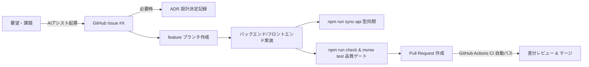

# 📦 MyHomeStock - 自宅在庫・買い物リスト管理 Web/PWA アプリケーション

**Spring Boot 4 (Java 21) + React 18 (TypeScript Strict) + Vite + Tailwind CSS + PostgreSQL 16 + PWA** で構築された、高品質・高信頼な自宅在庫管理システムの開発リポジトリです。
フロントエンド（React PWA）とバックエンド（Spring Boot 4 REST API）を単一の実行可能 JAR に統合し、Oracle Cloud (OCI) Always Free 上で最小構成・CORS ゼロで稼働する **OCI Consolidated Single JAR モノリス** アーキテクチャを採用しています。

AI コーディングエージェント（Antigravity, Cursor, Claude, Copilot 等）と人間がペアプログラミングを行う際に、**「コンテキストドリフト・仕様破壊ゼロ・実務標準の GitHub Flow・ワンショット品質ゲート」** を実現する開発ハーネスが組み込まれています。

---

## ✨ 主な特徴

- 📱 **Progressive Web App (PWA)**:
  - iOS / Android のスマートフォンホーム画面に 1 タップでインストール可能。
  - Service Worker によるオフラインキャッシュにより、通信が不安定な場所でも閲覧可能。
- 🛡️ **JPA 楽観的排他制御 (Optimistic Locking)**:
  - 複数端末・家族間で同一在庫を同時に更新・消費しても、JPA `@Version` により競合を機械的に検知（HTTP 409 Conflict）。意図しないデータ上書きを防止。
- 👨‍👩‍👧‍👦 **家族共有・世帯マルチテナント基盤 (`household_id`)**:
  - スキーマ・エンティティ・API に世帯識別子を先行配備。リクエストヘッダー `X-Household-Id` によるデータ分離をサポートし、将来のアカウント認証追加時もスキーマ破壊ゼロ。
- 🔄 **OpenAPI 3.0 & TypeScript 型同期**:
  - SpringDoc が出力する REST API 仕様から、`openapi-typescript` によりフロントエンドの型定義（`schema.d.ts`）を自動生成。型の手動二重管理を根絶。
- 🚀 **ワンショット総合品質ゲート (`npm run check`)**:
  - シークレットスキャン (`scripts/securityCheck.js`)
  - ドキュメント & ADR 整合性検査 (`scripts/docCheck.js`)
  - TypeScript Strict 型検査 (`npm --prefix frontend run type-check`)
  - 純粋ドメインロジック単体テスト (`npm --prefix frontend run test:run`)
  - プロダクションバンドルビルド (`npm --prefix frontend run build`)
- 🏗️ **ドメイン駆動クリーンアーキテクチャ & Single JAR**:
  - フロントエンド: 純粋ビジネスロジック層 (`src/core/`) を UI/DOM から完全分離（単体テスト 100% 可能）。
  - バックエンド: `frontend-maven-plugin` により React PWA 静的資産を `target/classes/static/` に内包。`SpaWebMvcConfig` による SPA ルーティングフォールバックを完備。
- 🐳 **Docker & OCI フレンドリー**:
  - `docker-compose.yml` による PostgreSQL 16 + Single JAR アプリの 1 コマンド起動。
  - Oracle Cloud (OCI) Always Free 向け Multi-stage build Dockerfile によるセキュアな非 root 最小コンテナ。

---

## 🔄 開発ワークフロー（1サイクルの流れ）



1. **AIアシスト Issue 起票**: チャットで要望を伝えると、AIが受け入れ基準付きの Issue を自動整理・起票。
2. **ADR 記録**: 大きな技術選定・アーキテクチャ決定は `docs/adr/` に不変ログとして記録（ADR-0001〜0007 承認済）。
3. **ブランチ開発 & 型同期**: `feature/issue-<番号>-<概要>` ブランチで実装。API 変更時は `npm run sync-api` で型を即時同期。
4. **一括品質検査**: `npm run check` および `.\mvnw.cmd test` ですべての検査をパス。
5. **Pull Request & CI**: GitHub Actions CI が自動合格を確認後、安全にマージ。

---

## 🚀 クイックスタート

### 1. 前提条件
- **Node.js**: v20+
- **Java**: Java 21+ (IntelliJ IDEA の JDK または OpenJDK)
- **Docker**: Docker Desktop (PostgreSQL 起動用)

### 2. ローカル DB の起動
```bash
# PostgreSQL 16 コンテナを起動
npm run db:up
```

### 3. バックエンドの起動 (Spring Boot 4)
```bash
# Windows PowerShell の場合
.\mvnw.cmd spring-boot:run

# Linux / macOS の場合
./mvnw spring-boot:run
```
* API エンドポイント: `http://localhost:8080`
* Swagger UI (API仕様・動作確認): `http://localhost:8080/swagger-ui.html`
* OpenAPI JSON: `http://localhost:8080/v3/api-docs`

### 4. フロントエンドの起動 (React PWA 開発モード)
```bash
# 別ターミナルで実行 (ポート 5173 / バックエンドプロキシ)
npm run dev
```
ブラウザで `http://localhost:5173` にアクセスします。

### 5. 品質ゲート & 単体テストの実行
```bash
# フロントエンド・ドキュメント・シークレット検査 (1 コマンド)
npm run check

# バックエンド単体・リポジトリ・統合テスト (H2 インメモリ DB / 8 tests PASS)
.\mvnw.cmd test
```

### 6. OCI 本番向け Single JAR パッケージング
```bash
# フロントエンド React PWA を自動ビルドし、static/ に内包した単一 JAR を生成
.\mvnw.cmd clean package
```

---

## 📁 ディレクトリ構造

```
MyHomeStock/
├── .agents/skills/dev-harness/   # AIエージェント向け開発ハーネススキル
├── .github/
│   ├── ISSUE_TEMPLATE/           # Feature / Bug / Refactor / Harness / Docs Issue テンプレート
│   ├── PULL_REQUEST_TEMPLATE.md  # PR テンプレート
│   └── workflows/ci.yml          # GitHub Actions CI (自動品質検査)
├── docs/                         # 設計・事前検証・成果レポート (完全日本語)
│   ├── adr/                      # Architecture Decision Records (ADR-0001〜0007)
│   ├── issues/                   # Issue / タスク一覧 (Git-Tracked、オフライン対応、0000-template.md)
│   ├── pre_phase_verification.md # 4軸事前検証ログ
│   ├── implementation_plan.md    # 実装計画書
│   ├── walkthrough.md            # 成果レポート
│   ├── architecture.md           # アーキテクチャ設計書
│   └── openapi.json              # OpenAPI 3.0 仕様書ベースライン
├── scripts/
│   ├── securityCheck.js          # シークレットスキャナー
│   ├── docCheck.js               # ドキュメント整合性検査
│   └── syncApi.js                # SpringDoc OpenAPI -> TypeScript型自動同期
├── src/main/java/com/myhomestock/ # Spring Boot 4 (Java 21) REST API & SPA 配信
│   ├── config/                   # OpenAPI, Security, SpaWebMvcConfig
│   ├── controller/               # REST コントローラー & GlobalExceptionHandler
│   ├── domain/                   # Entity (@Version & household_id) & DTO
│   ├── repository/               # Spring Data JPA リポジトリ (世帯分離クエリ)
│   └── service/                  # サービス層 & トランザクション
├── src/main/resources/           # application.yml, Flyway マイグレーション
├── src/test/                     # バックエンドテスト (Repository, Controller, Health)
├── frontend/                     # React 18 + Vite 5 + TypeScript + PWA + Tailwind
│   ├── src/
│   │   ├── core/                 # 純粋ビジネスロジック (UI非依存、単体テスト 100%)
│   │   ├── api/                  # OpenAPI 自動生成型 & API クライアント
│   │   ├── hooks/                # TanStack Query カスタムフック
│   │   ├── components/           # UI / レイアウト / PWA バナー
│   │   └── App.tsx               # 在庫・買い物リストダッシュボード
│   └── tests/                    # Vitest 単体テスト
├── Dockerfile                    # OCI 向け Multi-stage build JRE 最小コンテナ
├── docker-compose.yml            # PostgreSQL 16 + Single JAR アプリ定義
├── pom.xml                       # ルート Maven 設定 (frontend-maven-plugin 同梱)
├── package.json                  # ルート統合スクリプト
├── AGENTS.md                     # AIエージェント開発ルール・規約
└── README.md
```

---

## 📜 ライセンス
MIT License
