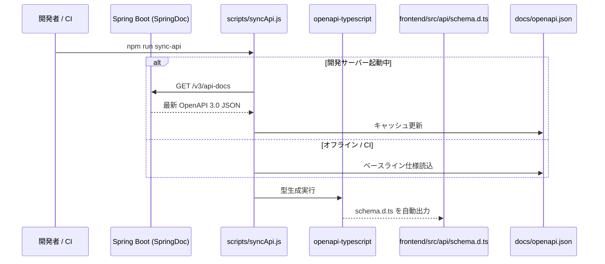

# MyHomeStock システムアーキテクチャ設計書

本ドキュメントは、自宅在庫・買い物リスト管理 Web/PWA アプリケーション **MyHomeStock** の全体アーキテクチャ、技術選定理由、データ整合性モデル、および開発・運用規約を定義する正本（Single Source of Truth）です。

---

## 1. 全体アーキテクチャ概要

* **構成モデル**: OCI 統合単一コンテナ / Single JAR アーキテクチャ（Spring Boot 4 + 内包 React PWA）
* **通信プロトコル**: RESTful API（HTTPS / JSON / 同一オリジン配信）
* **クライアント形態**: PWA（Progressive Web App / iOS, Android, PC ブラウザ対応）
* **データフロー**:
  ```mermaid
  graph TB
      subgraph Client["クライアント層 (PWA / Mobile / Web)"]
          PWA["React 18 + TypeScript (PWA)"]
          SW["Service Worker (オフラインキャッシュ)"]
          RQ["TanStack Query (キャッシュ・自動再検証)"]
          PWA --> SW
          PWA --> RQ
      end

      subgraph Gateway["通信・SPAルーティングレイヤー"]
          Proxy["Vite Proxy (Dev: :5173) / Same-Origin (Prod: :8080)"]
          SpaConfig["SpaWebMvcConfig (PathResourceResolver SPAフォールバック)"]
          OpenAPI["OpenAPI 3.0 (openapi-typescript 型自動同期)"]
          RQ -.->|同一オリジン Fetch / CORSゼロ| Proxy
          OpenAPI -.->|型生成| PWA
      end

      subgraph Backend["バックエンド層 (Spring Boot 4 / Java 21 / Single JAR)"]
          Sec["Spring Security (Stateless / 認証認可)"]
          Ctrl["REST Controller (SpringDoc Swagger UI)"]
          Svc["Service Layer (@Transactional / 楽観排他 / 世帯分離)"]
          JPA["Spring Data JPA (Hibernate)"]
          Flyway["Flyway (DBマイグレーション)"]
          Proxy --> SpaConfig --> Sec --> Ctrl --> Svc --> JPA
          Flyway --> DB
      end

      subgraph Database["データベース層"]
          DB[("PostgreSQL 16 (楽観排他制御 @Version / 世帯 household_id)")]
          JPA --> DB
      end
  ```

---

## 2. フロントエンド設計（Frontend）

### 2.1 技術選定と責務
| 技術 | バージョン/選定理由 |
| :--- | :--- |
| **TypeScript** | v5.x: 厳格な型安全性（Strict Mode）、バックエンド OpenAPI スキーマとの 100% 型同期 |
| **React** | v18+: コンポーネント指向 UI、仮想 DOM による高速描画、カスタムフックによる状態カプセル化 |
| **Vite** | v5.x: 高速ローカル HMR、最適化 Rollup バンドル |
| **Tailwind CSS** | v3.x: ユーティリティファースト、モバイルファーストレスポンシブデザイン |
| **vite-plugin-pwa** | Service Worker 自動生成、Web App Manifest、ホーム画面追加バナー、オフラインキャッシュ |
| **TanStack Query** | サーバー状態キャッシュ、自動フェッチ、楽観的更新、ウィンドウフォーカス時自動再検証 |
| **Radix UI / Lucide** | アクセシビリティ標準準拠のヘッドレス UI、軽量かつ統一感のあるアイコン |

### 2.2 ディレクトリ構成とクリーンアーキテクチャ
```
frontend/src/
├── core/             # 純粋なビジネスロジック (在庫不足・賞味期限判定、DOM/React依存ゼロ、100%単体テスト可能)
├── api/              # OpenAPI 自動生成型 (schema.d.ts) および型安全 API クライアント (client.ts)
├── hooks/            # TanStack Query カスタムフック (useStockItems 等)
├── components/
│   ├── ui/           # アトミックコンポーネント (Button, Card, Badge, Input 等)
│   └── layout/       # ヘッダー、PWAインストールプロンプトバナー
├── App.tsx           # 在庫一覧、買い物リスト、期限注意のタブ切替ダッシュボード
└── main.tsx          # QueryClient 初期化、PWA サービスワーカー登録
```

---

## 3. バックエンド設計（Backend）

### 3.1 技術選定と責務
| 技術 | バージョン/選定理由 |
| :--- | :--- |
| **Java 21 (LTS)** | 仮想スレッド対応、モダン構文、長期保守性 |
| **Spring Boot** | 4.0.8: 内蔵 Tomcat、Spring Initializr 公式標準、Spring Framework 7 世代の最新エコシステム |
| **Spring Data JPA** | Hibernate による堅牢な ORM、型安全なリポジトリ、トランザクション境界の保証 |
| **Spring Security** | ステートレス REST API セキュリティ、静的資産・SPA ルート公開制御 |
| **Jakarta Bean Validation** | アノテーションベース（`@NotBlank`, `@Min` 等）のリクエストボディ検証 |
| **SpringDoc OpenAPI** | OpenAPI 3.0 仕様書（`/v3/api-docs`）および Swagger UI（`/swagger-ui.html`）の自動生成 |
| **Flyway** | SQL スクリプトによる DB スキーマのバージョン管理と自動マイグレーション |

### 3.2 パッケージ構成
```
src/main/java/com/myhomestock/
├── MyHomeStockApplication.java  # メインエントリポイント
├── config/                      # OpenApiConfig, SecurityConfig, SpaWebMvcConfig
├── domain/
│   ├── entity/                  # JPA エンティティ (StockItem with @Version & householdId)
│   └── dto/                     # Request/Response DTO (バリデーション付き)
├── repository/                  # Spring Data JPA リポジトリ (StockItemRepository)
├── service/                     # ビジネスロジック & トランザクション (@Transactional)
└── controller/                  # REST コントローラー & GlobalExceptionHandler
```

---

## 4. データベース & 並行性・マルチテナント制御（Database）

### 4.1 PostgreSQL 16 & Flyway
* ローカル開発環境では `docker-compose.yml` により 1 コマンドで起動・破棄可能。
* スキーマ変更は `src/main/resources/db/migration/` 配下の `V1__init_schema.sql` などの Flyway スクリプトで管理。

### 4.2 楽観的排他制御 (Optimistic Locking)
夫婦や家族などの複数人がスマートフォンから同時に同一在庫（例: 牛乳）を更新・消費した場合、後勝ちによる不整合や意図しない上書きを防止するため、JPA の `@Version` を使用した楽観的排他制御を採用：
1. `stock_items` テーブルに `version BIGINT NOT NULL DEFAULT 0` カラムを配備。
2. 更新時、リクエストの `version` と DB の `version` を照合。
3. 競合時は Spring が `OptimisticLockingFailureException` をスローし、`GlobalExceptionHandler` が HTTP `409 Conflict` を返却。
4. フロントエンド（TanStack Query）は 409 を検知してユーザーに通知し、自動で最新データを再フェッチ。

### 4.3 世帯マルチテナント基盤 (`household_id`)
* `stock_items` テーブルに `household_id VARCHAR(50) NOT NULL DEFAULT 'default'` を先行配備。
* API リクエストヘッダー `X-Household-Id` により、将来的な家族間アカウント共有や複数グループ対応時にスキーマ変更なしで即座に対応可能。

---

## 5. API 仕様 & 型同期フロー（Schema & Type Sync）



型の手動二重管理を根絶し、バックエンドの DTO 変更が即座にフロントエンドのコンパイルエラーとして検知されます。

---

## 6. インフラストラクチャ & デプロイ設計 (OCI Single JAR & Immutable CD)

* **ローカル開発**:
  - `docker compose up -d postgres` で PostgreSQL 16 が即座に稼働。
  - バックエンド: `.\mvnw.cmd spring-boot:run` (ポート 8080)
  - フロントエンド: `npm run dev` (ポート 5173 / Vite Proxy)
* **イミュータブル CD パイプライン (GitHub Actions & GHCR)**:
  - `main` ブランチマージ契機で GitHub Actions（Node 24 / Actions v5）が自動起動。
  - x86_64 ネイティブランナー上で Single JAR（Maven + Vite 内包）を事前生成し、QEMU エミュレーション遅延（15〜20分）を完全排除。
  - 本番専用の軽量 JRE コンテナ定義 [`Dockerfile.prod`](file:///c:/Users/yukiy/IdeaProjects/MyHomeStock/Dockerfile.prod) を介して ARM64 コンテナ化し、GitHub Container Registry (GHCR: `ghcr.io/yuki-yamagishi/my-home-stock`) へプッシュ。
* **本番運用 (OCI Always Free / Pull 型デプロイ)**:
  - Oracle Cloud Infrastructure (OCI) Always Free (Ampere A1 / 4コア / 24GB メモリ) 上で [`docker-compose.prod.yml`](file:///c:/Users/yukiy/IdeaProjects/MyHomeStock/docker-compose.prod.yml) により稼働。
  - **Watchtower (`nickfedor/watchtower:latest`)**: Docker API v1.44 ネイティブ対応のコンテナ自動更新エージェントを常駐運用。`--interval 60`（1分間隔）で GHCR の新規イメージを Pull 監視。
  - **高境界防御**: 外向き（Outbound HTTPS: 443）通信のみで自動更新を検知・再起動するため、OCI インスタンスの SSH ポート（22番）を全世界に公開する必要が一切ない。
  - **DB 巻き込み再起動の物理防止**: `app` コンテナにのみ `com.centurylinklabs.watchtower.enable: "true"` を付与し、Watchtower 側で `--label-enable` を指定して PostgreSQL の不意な再起動・データ破損を防止。
  - **Caddy によるリバースプロキシ & 常時 HTTPS**: ポート 80/443 を受領し Let's Encrypt 自動 SSL 発行。内部ポート 8080 の Spring Boot コンテナへ安全にプロキシ（Google OAuth2 / Secure Cookie 完全対応）。

