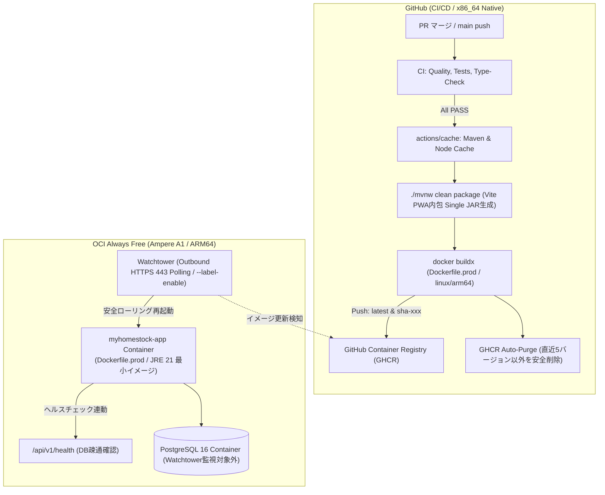

# [ISSUE-009] OCI Always Free 向け GitHub Actions イミュータブル継続的デプロイ（CD）パイプラインの構築

* **ステータス**: 🔵 `status: in-progress`
* **種別**: 🚀 `type: ci` / 🛠️ `type: harness`
* **担当者**: AIエージェント
* **作成日**: 2026-09-15
* **関連 ADR / PR**: ADR-0005, ADR-0007, ADR-0011 (新規予定)

---

## 1. 解決すべき課題・背景 (Why / Background)

### 1.1. なぜ今やるのか (Why)
現在、MyHomeStock リポジトリでは [`.github/workflows/ci.yml`](file:///c:/Users/yukiy/IdeaProjects/MyHomeStock/.github/workflows/ci.yml) による CI（セキュリティガード、Spring Boot 単体・結合テスト、TypeScript 型検査、Vite PWA ビルド）が整備されているが、`main` ブランチにマージされた後の **OCI (Oracle Cloud Infrastructure) Always Free 本番環境への反映は手動運用** となっている。
手動デプロイはデプロイ漏れ、ヒューマンエラー、環境間ドリフトを引き起こすため、マージをトリガーとした完全自動の継続的デプロイ（CD）の構築が急務である。

### 1.2. 排除すべきアンチパターン (Anti-Patterns to Reject)
「手軽だから」「設定手順が少ないから」と、本番サーバー上で `git pull` を行い直接 `docker compose up -d --build` を実行する手法は、以下の致命的な運用破綻を招くため **厳禁・完全排除** とする：
- **リソース枯渇・本番停止**: 本番稼働中のサーバーで Maven（Java）と Vite（Node.js）の重い並行ビルドが走り、CPU/メモリが急騰して OOM Killer による本番コンテナ停止やレスポンス遅延を引き起こす。
- **再現性・品質保証の崩壊**: CI で厳密に検証されたバイナリと本番で稼働するバイナリが別物となり、サーバー側の環境差異やキャッシュ破損による障害リスクが生じる。
- **セキュリティの侵害**: 本番サーバーにソースコード一式、Git 履歴、および GitHub へのアクセス権限（Deploy Key / Token）が常駐する。

したがって、業界標準のベストプラクティスである **「GitHub Container Registry (GHCR) を介したイミュータブル（再現可能・不変）コンテナデプロイ」** を正道として採用する。

---

## 2. 排除するリスク (Risks to Eliminate)

1. **【最大ボトルネック】CPU アーキテクチャ差異によるビルド時間増大（QEMU 遅延）の排除**:
   - GitHub Actions の無料 Runner は `linux/amd64` (x86_64) であり、OCI Always Free の主力（Ampere A1）は `linux/arm64` (aarch64) である。
   - QEMU エミュレーションによる ARM64 向け Docker フルビルドは、命令変換オーバーヘッドにより 15〜20 分以上を要する。
   - **対策**: Single JAR（Maven + Vite）のバイナリ生成は GitHub Actions の x86_64 ネイティブ上で高速実行（OS/CPU ニュートラル）。コンテナ化のみ本番専用の軽量 [`Dockerfile.prod`](file:///c:/Users/yukiy/IdeaProjects/MyHomeStock/Dockerfile.prod) を新設し、事前ビルド済み Single JAR を `eclipse-temurin:21-jre-alpine` に直接 `COPY` することで、エミュレーションコンパイルを完全排除し、デプロイ完了時間を数分に短縮する。ローカル開発用の既存 [`Dockerfile`](file:///c:/Users/yukiy/IdeaProjects/MyHomeStock/Dockerfile) は自己完結型として一切破壊せず維持する。
2. **インバウンド SSH ポート開放による攻撃リスクの排除**:
   - GitHub Actions ランナーの動的 IP に対して OCI の SSH（22番ポート）を全世界（`0.0.0.0/0`）に開放することは攻撃対象面を過度に拡大させる。
   - **対策**: OCI 側から GHCR へ外向き（Outbound HTTPS: 443）の通信のみでイメージ更新を検知・取得する **Pull 型デプロイ（Watchtower の常駐運用）** を標準採用し、インバウンド SSH の常時公開を不要にする。
3. **Watchtower による DB コンテナ巻き込み再起動および認証失敗リスクの排除**:
   - Watchtower が PostgreSQL コンテナまで検知して再起動すると、データ書き込み中のトランザクション切断を招く。また GHCR が Private の場合、認証不足で更新取得に失敗する。
   - **対策**: アプリコンテナにのみ `com.centurylinklabs.watchtower.enable=true` ラベルを付与し、Watchtower 起動オプションに `--label-enable` を指定して DB コンテナを完全に除外する。また、GitHub PAT（`read:packages` 権限）による GHCR 認証情報をセキュアに注入する。
4. **ヘルスチェック仕様矛盾およびコンテナ切り替え時の瞬断（502 Bad Gateway）の排除**:
   - コンテナ再起動時に Spring Boot が初期化されるまでの間、リクエストが途絶する。
   - **対策**: 既存の堅牢なヘルスチェックエンドポイント [`/api/v1/health`](file:///c:/Users/yukiy/IdeaProjects/MyHomeStock/src/main/java/com/myhomestock/controller/HealthController.java)（DB 接続性確認を含む）を本番ヘルスチェックとして正式採用し、未導入の Actuator との仕様矛盾を排除する。Docker の `healthcheck` と連動させ、新コンテナが健全（`healthy`）になるまで待機する。また、PWA の Service Worker オフラインキャッシュによりクライアント側の白画面化を防止する。
5. **GHCR ストレージ容量の枯渇と不要イメージの無制限蓄積の排除**:
   - コミットごとに作成されるイメージタグが蓄積し、レジストリ容量を圧迫する。
   - **対策**: GitHub Actions に古いパッケージイメージの自動削除ステップを組み込み、**`latest` タグおよび直近 5 バージョンを恒久保護し、それ以前の古いタグのみを自動パージ** する。
6. **DB スキーママイグレーション（Flyway）の破壊的ロールバック不能リスクの排除**:
   - ロールバック時に旧バージョンのコンテナが DB スキーマ不一致で起動できなくなるリスク。
   - **対策**: Expand & Contract パターンの厳守（前方・後方互換性のあるマイグレーション運用）を標準化する。

---

## 3. 要件定義 (Requirements)

1. **本番専用軽量コンテナ定義 (`Dockerfile.prod`) の新設**:
   - `eclipse-temurin:21-jre-alpine` をベースとしたセキュアな非 root 実行環境。
   - GitHub Actions 上で事前ビルドされた Single JAR (`target/*.jar`) を直接 `COPY` して起動。
   - 既存の自己完結型 [`Dockerfile`](file:///c:/Users/yukiy/IdeaProjects/MyHomeStock/Dockerfile)（ローカル開発用）はそのまま維持し、開発者体験（DX）を破壊しない。
2. **GitHub Actions ワークフロー (`.github/workflows/deploy.yml`) の新設**:
   - トリガー: `main` ブランチへの push（PR マージ完了時）。
   - 依存関係: CI ジョブ（`quality-gate`, `backend`, `frontend`）が全パスした場合のみ実行（`needs: [quality-gate, backend, frontend]`）。
   - キャッシュ最適化: `actions/cache` による Maven 依存関係および Node.js キャッシュを活用。
   - x86_64 ネイティブでの Single JAR 生成 (`./mvnw clean package -DskipTests`)。
   - `docker/setup-qemu-action` および `docker/setup-buildx-action` を使用し、`Dockerfile.prod` から `linux/arm64` 向けイメージを生成して GHCR へ push。
   - タグ付与: `ghcr.io/<owner>/<repo>:sha-${{ github.sha }}` および `:latest`。
   - 権限設定: `packages: write`（パッケージ push および不要バージョンパージ用）。
3. **GHCR 自動パージステップの組み込み**:
   - `latest` タグおよび直近 5 つのコミット SHA タグを保持し、それ以前の古いパッケージバージョンを自動パージ。
4. **OCI 本番用 `docker-compose.prod.yml` の定義**:
   - `app` サービス: GHCR から pull したイメージを使用。
     - `labels`: `com.centurylinklabs.watchtower.enable: "true"`
     - `healthcheck`: `test: ["CMD", "wget", "-qO-", "http://localhost:8080/api/v1/health"]`
   - `postgres` サービス: PostgreSQL 16 (内部ネットワーク接続、ホスト公開ポートなし)。
   - `watchtower` サービス:
     - 監視間隔（例: 300秒 / 5分間隔で GHCR をポーリング）。
     - `--label-enable` オプションにより `app` コンテナのみを対象とし、DB コンテナの誤再起動を物理防止。
     - 環境変数 `REPO_USER` / `REPO_PASS`（または `~/.docker/config.json` マウント）による GHCR 認証。
5. **ADR-0011 の作成**:
   - イミュータブル CD パイプライン、バイナリビルド分離、および Watchtower による Pull 型デプロイの設計決定を不変記録として採択。

---

## 4. 技術設計・実装方針 (Technical Notes / Design)

- **影響範囲 (Impact Scope)**:
  - `.github/workflows/deploy.yml` (新規作成)
  - `Dockerfile.prod` (新規作成: 本番専用 Single JAR 単一ステージ JRE コンテナ)
  - `docker-compose.prod.yml` (新規作成: OCI 本番用スタック定義)
  - `docs/adr/0011-oci-continuous-deployment-ghcr.md` (新規作成)
  - `docs/issues/README.md` (インデックス更新)

---

## 5. 受け入れ基準 (Acceptance Criteria / DoD)

### 📋 客観的検証シナリオ (Given-When-Then)

#### シナリオ 1: 正常系 - main マージ時の高速イミュータブル CD パイプライン完了
- **Given**: すべての単体テスト・型チェック・品質ガードが合格している PR が `main` ブランチへマージされる。
- **When**: GitHub Actions の `deploy.yml` が自動起動する。
- **Then**:
  - x86_64 ネイティブ Runner 上で Maven キャッシュを活用して Single JAR が高速生成される。
  - `Dockerfile.prod` により `linux/arm64` 向けコンテナイメージがビルドされる。
  - GHCR に `ghcr.io/<owner>/<repo>:sha-<commit-sha>` および `:latest` のタグが付与されてプッシュが完了する。
  - 全工程が **10分以内** で完了すること。

#### シナリオ 2: 異常系・安全ガード - CI 失敗時の CD 実行完全抑止
- **Given**: `main` への push またはマージにおいて、単体テスト・フロントエンド型検査・セキュリティゲートのいずれか 1 つでも失敗（FAIL）している。
- **When**: ワークフローが実行される。
- **Then**:
  - デプロイジョブ（Single JAR 生成、Docker ビルド、GHCR プッシュ）は実行されず（SKIPPED または CANCELLED となる）。
  - 不完全・未検証のイメージが GHCR に公開される事故が機械的に防止されること。

#### シナリオ 3: 本番反映 - Watchtower による安全な更新と DB 巻き込み防止
- **Given**: OCI 上で `docker-compose.prod.yml` が稼働しており、GHCR に新しいイメージ（`:latest`）がプッシュされる。
- **When**: Watchtower が更新を検知して `app` コンテナのプルと再起動を行う。
- **Then**:
  - `app` コンテナのみが更新・再起動され、`postgres` コンテナは再起動されずに稼働を継続すること（`--label-enable` の検証）。
  - 新コンテナ起動時、`/api/v1/health` が 200 OK を返すまで Docker ヘルスチェックが監視を行い、健全に稼働開始すること。

#### シナリオ 4: レジストリ衛生管理 - GHCR パッケージの自動パージ
- **Given**: GHCR に多数のコミット SHA タグが存在する。
- **When**: `deploy.yml` 内のクリーンアップステップが実行される。
- **Then**:
  - `latest` タグおよび直近 5 バージョンは確実に保護・保持される。
  - 直近 5 バージョンより古いタグのみが安全に自動パージされ、ストレージ圧迫が防止されること。

### 5.1. PR作成前プロセス完了基準 (Pre-PR DoD)
- [x] `Dockerfile.prod` が作成され、既存の `Dockerfile`（ローカル環境）が破壊されていないこと
- [x] 本番用の `docker-compose.prod.yml` および環境変数設定手順が整備されていること
- [x] `.github/workflows/deploy.yml` が作成され、CI 依存関係（`needs:`）および ARM64 GHCR push が定義されていること
- [x] `docs/adr/0011-oci-continuous-deployment-ghcr.md` が作成され、`docs/adr/README.md` に登録されていること
- [x] `npm run check` によるドキュメント整合性ガードおよび全品質検証に合格していること
- [x] `.\mvnw.cmd test` によるバックエンドテスト全件（24 tests）が PASS していること

### 5.2. マージ前完了基準 (Pre-Merge DoD)
- [ ] PR 作成後の GitHub Actions CI が自動合格すること
- [ ] 独立レビューサブエージェント合議制（`fleet_reviewer`, `fleet_completion_auditor`, `stock_domain_auditor`）の全 LGTM を受領すること
- [ ] ユーザー（人間）による最終確認とマージが完了すること
